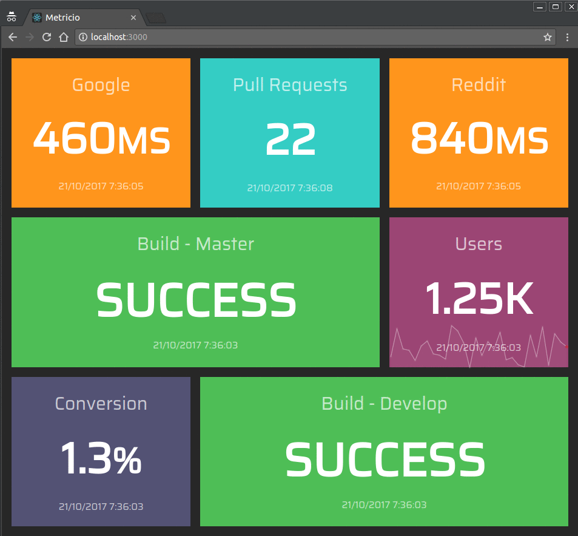
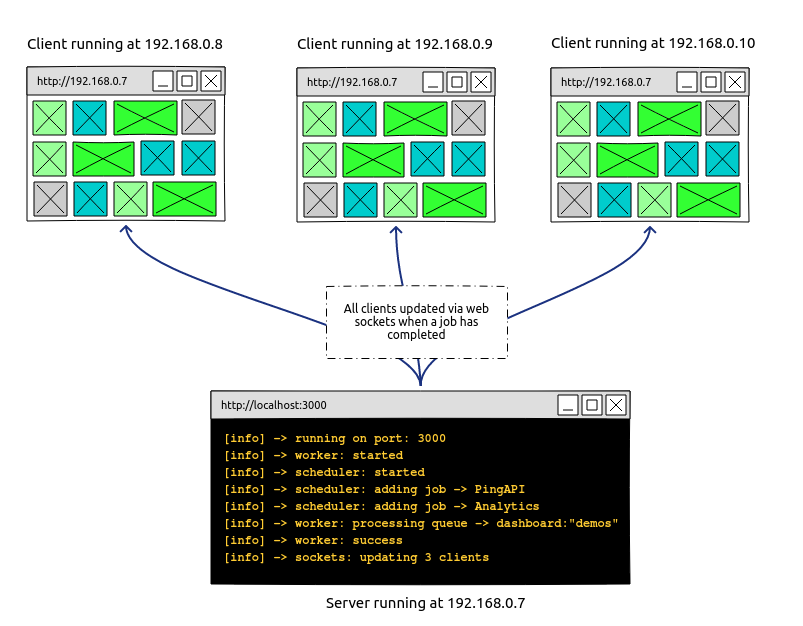

[](https://semaphoreci.com/dannycroft/metricio)


Metricio is a dashboard framework that helps you display metrics and monitor systems and APIs.

Simple to get started and quick to create build screens for all your teams.

Metricio has a similar design and achitecture to [Dashing](http://dashing.io/), which was my "goto" framework for dashboards for years. Unfortunately, Dashing is [no longer maintained](https://github.com/Shopify/dashing/issues/711). But if still you prefer to write CoffeeScript and Ruby then that framework is still awesome!

Metricio allows you to:

- Build `widgets` with React components
- Create `jobs` with Node.js and `async/await`
- Support for multiple `dashboards`
- CRON like scheduling with [node-scheduler](https://github.com/node-schedule/node-schedule)
- Caching is handled with [Redis](https://redis.io/)
- Event-based communication with [socket.io](https://socket.io/)

The UI aims to use little resource as possible. Enabling your dashboards to run without crashing for prolonged lengths of time on even the most neglected Raspberry Pi.



### Requirements

- Node v8.0.0+
- Redis v2+

### Get started

```
git clone https://github.com/dannycroft/metricio.git
```

```
npm i && npm run start
```

Open your browser at `http://localhost:3000`

### Storage

If you have a specific Redis configuration then you can set the following environment variables, otherwise defaults will be used:

- Host: `REDIS_SERVER_HOST`
- Port: `REDIS_SERVER_PORT`
- Password: `REDIS_SERVER_PASSWORD`

### Customisation

Everything you need can be found in [src](./src).

- `./src/dasboards`: where all dashboards should be created. A [default](./src/dashboard.jsx) dasboard is already available for you to see. See [dashboards](#dashboards) for more infomation.
- `./src/widgets`: contains all currently available widgets. You can create your own or use the [existing](./src/widgets) ones. See [widgets](#widgets) for more infomation.
- `./src/jobs`: contains all currently available jobs. You can create your own or use the [existing](./src/jobs) ones.  See [jobs](#jobs) for more infomation.

### Widgets

More info coming soon.

### Jobs

More info coming soon.

### Raspberry Pi

This framework was created to enable many dashboards to be powered by one machine. Once metricio is up and running on a machine you can connect it to your local network and use it as a server. Just use the local IP address of the server machine and browse to that with as many clients as you need. Preferebly with a modern browser.



### Test

```
npm run test
```

### Coverage

```
npm run coverage
```

### Contributing

Any help is welcomed and appreciated.

## License
Distributed under the [MIT license](LICENSE)
